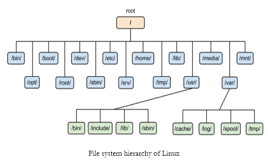

UNIX Services
=============

Init                                        
--------------------------------------------

The single most important service in a UNIX system is provided by init init is started as the first process of every UNIX system, as the last thing the kernel does when it boots. When init starts, it continues the boot process by doing various startup chores (checking and mounting filesystems, starting daemons, etc).                

init usually provides the concept of single user mode, in which no one can log in and root uses a shell at the console; the usual mode is called multiuser mode.

Linux allows for up to 10 runlevels, 0−9, but usually only some of these are defined by default.

*   Runlevel 0 is defined as “system halt".
*   Runlevel 1 is defined as “single user mode".
*   Runlevel 3 is defined as "multi user" because it is the runlevel that the system boot into under normal day to day conditions.
*   Runlevel 5 is typically the same as 3 except that a GUI gets started also.
*   Runlevel 6 is defined as “system reboot".

Other run levels are dependent on how your particular distribution has defined them, and they vary significantly between distributions.

Logins from terminals
---------------------

Logins from terminals (via serial lines) and the console (when not running X) are provided by the gettyprogram. init starts a separate instance of gettyfor each terminal upon which logins are to be allowed. gettyreads the username and runs the login program, which reads the password. If the username and password are correct, login runs the shell. When the shell terminates, i.e., the user logs out, or when login terminated because the username and password didn't match, init notices this and starts a new instance of getty. The kernel has no notion of logins, this is all handled by the system programs.

Syslog
------

The kernel and many system programs produce error, warning, and other messages. It is often important that these messages can be viewed later, even much later, so they should be written to a file. The program doing this is syslog .

Periodic command execution: cron and at
---------------------------------------

Both users and system administrators often need to run commands periodically. The cronservice is set up to do this. Each user can have a crontabfile, where she lists the commands she wishes to execute and the times they should be executed. The cron daemon takes care of starting the commands when specified.

The atservice is similar to cron, but it is once only: the command is executed at the given time, but it is not repeated.

Networking
----------

UNIX operating systems have many networking features. Most basic services (filesystems, printing, backups, etc) can be done over the network. This can make system administration easier, since it allows centralized administration, while still reaping in the benefits of microcomputing and distributed computing, such as lower costs and better fault tolerance.

Network logins
--------------

Network logins work a little differently than normal logins. For each person logging in via the network there is a separate virtual network connection, and there can be any number of these depending on the available bandwidth. It is therefore not possible to run a separate getty for each possible virtual connection. There are also several different ways to log in via a network, telnetand ssh being the major ones in TCP/IP networks.

These days many Linux system administrators consider telnet and rlogin to be insecure and prefer ssh, the “secure shell”, which encrypts traffic going over the network. Network logins have a single daemon per way of logging in (telnet and ssh have separate daemons) that listens for all incoming login attempts.

Network file systems
--------------------

One of the more useful things that can be done with networking services is sharing files via a network file system. Depending on your network this could be done over the Network File System (NFS), or over the Common Internet File System (CIFS). NFS is typically a 'UNIX' based service. In Linux, NFS is supported by the kernel. CIFS however is not. In Linux, CIFS is supported by Samba.

Mail
----

Each user has an incoming mailbox (a file in the special format), where all new mail is stored. When someone sends mail, the mail program locates the receiver's mailbox and appends the letter to the mailbox file. If the receiver's mailbox is in another machine, the letter is sent to the other machine, which delivers it to the mailbox as it best sees fit.

The mail system consists of many programs. The delivery of mail to local or remote mailboxes is done by one program (the mail transfer agent (MTA) , e.g., sendmail or postfix ), while the programs users use are many and varied (mail user agent (MUA) , e.g., pine , or evolution . The mailboxes are usually stored in /var/spool/mail until the user's MUA retrieves them.

The filesystem layout
---------------------

The filesystem is divided into many parts; usually along the lines of a root filesystem with /bin , /lib , /etc , /dev , and a few others; a /usr filesystem with programs and unchanging data; /var filesystem with changing data (such as log files); and a /home for everyone's personal files. Depending on the hardware configuration and the decisions of the system administrator, the division can be different; it can even be all in one filesystem.

* * *

Linux Binary Directory
----------------------

Binary files are the files which contain compiled source code (or machine code). They are also called executable files because they can be executed on the computer.

Binary directory contains following directories:

*   /bin
*   /sbin
*   /lib
*   /opt

### /bin

The '/bin' directory contains user binaries, executable files, Linux commands that are used in single user mode, and common commands that are used by all the users, like cat, cp, cd, ls, etc.

The '/bin' directory doesn't contain directories.

### /sbin

The '/sbin' directory also contains executable files, but unlike '/bin' it only contains system binaries which require root privilege to perform certain tasks and are helpful for system maintenance purpose. e.g. fsck, root, init, ifconfig, etc.

### /lib

The '/lib' directory contains shared libraries which are often used by the '/bin' and '/sbin' directories. It also contains kernel module. These filenames are identable as ld* or lib*.so.*. For example, ld-linux.so.2 and libfuse.so.2.8.6

*   /lib/modules: The '/lib/modules' stores kernel modules and has a directory for each installed kernel.Modules are meant to use extra hardware support without making a new kernel.
*   /lib32 and /lib64: During compilation time of libraries you'll encounter through the directories named '/lib32' and '/lib64' which will clarify register size to be used. A 64-bit system may have compatibility for 32-bit binary.

### /opt

The term 'opt' is short for optional. Its main purpose is to store optional application software packages. Add-on applications from individual vendors should be installed in '/opt'. And so in some systems '/opt' is empty as they may not have any add-on application.

Linux Configuration Directory
-----------------------------

The configuration directory contains configured files which configures the parameters and initial settings for some computer programs.

Configuration directory have following subdirectories:

*   /boot
*   /etc

### /boot

The '/boot' directory contains boot loader files which are essential to boot the system. In other words, they only contain files which are needed for a basic Linux system to get up and going.

You may find '/boot/grub' directory which contains '/boot/grub/grub.cfg' (older system may have /boot/grub/grub.conf) which defines boot menu that is displayed before the kernel starts.

### /etc

All the machine related configuration files are kept in '/etc'. Almost everything related to the configuration of your system is placed here. It also contain startup and shutdown shell script which is used to start and stop a program. All the files are static and text based and no binary files can be placed in this directory.

The meaning of 'etc' is very controversial. Earlier it was referred to as 'Etcetera' because it could contain all the files that did not belong from anywhere else. But recently its most likely meaning is 'Editable Text Configuration' or 'Extended Tool chest'.

Some common directories of /etc are:

*   /etc/init.d/: The term 'init' is short for initialization. This directory contains script to control the system or to start and stop the daemons (background process). The 'init' is a daemon process that continues running until the system is shut down.
*   /etc/X11/: The X Window system configuration files are stored in this directory. The configuration file of graphical display (xorg.conf) is also stored here.
*   /etc/skel/: The term 'skel' is short for skeleton. Everything in the system has a skeleton which is called hidden file and is stored in this directory. It is not an important part in the system and can be deleted but still it serves a specific purpose. Its purpose is to serve the basic set of files, a basic framework which can be used in the creation of a new user.

* * *

Linux Data directory
--------------------

Data directory is used to store data of the system.

Data directory contains following directories.

*   /home
*   /root
*   /srv
*   /media
*   /mnt
*   /tmp

### /home

The '/home' directory stores users personnel files. After the '/home' there is a directory which is generally named at the user's name like we have '/home/sssit'. Inside this directory we have our subdirectories like Desktop, Downloads, Documents, pictures, etc.

### /root

The '/root' directory is the home directory of the root user.

Please note that '/root' directory is different from (/) root.

### /srv

The term 'srv' is short for service. The '/srv' directory contains server specific data for services provided by the system like www, cvs, rysync, ftp, etc.

### /media

The '/media' directory acts as a mount point for removable media devices such as CD-Rom, floppy, USB devices, etc.

This is newly introduced directory and hence a system can run without this directory also.

### /mnt

The term 'mnt' stands for mount. The '/mnt' directory should be empty and sysadmins can only mount temporary filesystems.

### /tmp

The term 'tmp' stands for temporary. Data stored in '/tmp' is temporary and may use either disk space or RAM. When system is rebooted, files under this directory is automatically deleted. So it is advisable that never use '/tmp' to store important data.

* * *

Linux Memory Directory
----------------------

Memory directory contains files of the whole system. All the device information, process running in data or system related information are stored in this directory.

Memory directory contains the following directories.

*   /dev
*   /proc
*   /sys

### /dev

The term 'dev' is short for device. As you know in Linux operating system everything is a file. It appears to be an ordinary file but doesn't take up disk space. Files which are used to represent and access devices are stored here including terminal devices like usb. All the files stored in '/dev' are not related to real devices, some are related to virtual devices also.

*   /dev/tty and /dev/pts: The '/dev/tty' file represents the command line interface that is a terminal or console attached to the system. Typing commands in a terminal is a part of the graphical interface like Gnome or KDE, then terminal will be represented as '/dev/pts/1' (here 1 is replaceable by any other number).
*   /dev/null: The '/dev/null' file is considered as black hole, it has unlimited storage but nothing can be retrieved from it. You can discard your unwanted output from the terminal but can't retrieve it back.

### /proc

The term 'proc' is short for process. Same as '/dev', '/proc' also doesn't take up disk space. It contains process information. It is a pseudo filesystem that contains information about running processes. It also works as virtual filesystem containing text information about system resources.

*   /proc conversation with the kernel: The '/proc' displays view of the kernel, what the kernel manages and it is a means to directly communicate with the kernel.
    The '/proc' has some file properties like date, which keeps on updating as shown in the below snapshot.
    Also most of the files in '/proc' are of 0 bytes yet they contain a lot of data. Most of the files are readable only, some require root privileges and some are writable.
*   /proc/interrupts: The '/proc/interrupts' displays the interrupt.

### /sys

The term 'sys' is short for system. Basically it contains kernel information about hardware. It was created for Linux 2.6 kernel. It is a kind of '/proc' and is used for plug and play configuration.

* * *

Unix System Resources (/usr)
----------------------------

Although it is pronounced as user but in actual it stands for Unix System Resources. It is also called secondary hierarchy as it contains binaries, libraries, documentation for all the user applications. It only contains shareable read-only data.

*   /usr/bin
*   /usr/include
*   /usr/lib
*   /usr/share
*   /usr/local
*   /usr/src

### /usr/bin

The '/usr/bin' directory contains non-essential binary commands for all users. If you can't find a command in '/bin', search it in '/usr/bin'. It contains a lot of commands.

### /usr/include

The '/usr/include' directory contains standard include files for C.

### /usr/lib

The '/usr/lib' directory contains libraries that are not directly executed by the users. In other words, it contains binaries for the '/usr/bin' and '/usr/sbin'.

### /usr/share

The '/usr/share' directory contains architecture independent (shared) data.

### /usr/local

The '/usr/local' directory is used to install software locally. It means all the user programs that you'll install from source will be installed here.

### /usr/src

The term 'src' is short for source. It is used to store source code like kernel source code with its header files.

* * *

Variable Directory (/var)
-------------------------

The term 'var' is short for varible. Files that have an unexpected size and whose content is expected to change continuously (that's why it is named as variable) during normal operation of the system are stored here. For example, log files, spool files and cache files.

We'll explain some of the /var sub-directories here:

*   /var/log
*   /var/cache
*   /var/spool
*   /var/lib

### /var/log

The '/var/log' directory contains all log files.

### /var/cache

The '/var/cache' directory stores application cache data. Cache data are locally generated by I/O or calculation. Cache must be able to regenerate or restore the data. These files can be deleted without any loss of data.

### /var/spool

The '/var/spool' directory is used to spool the files waiting to be processed. For example, printing queues and mail queues.

### /var/lib

The '/var/lib' directory stores the files that contains state information like databases. File's data modified as their respective programs run.

* * *

Non-Standard Directories
------------------------

Directories which do not come under the standard FHS are called non-standard directories.

Non-standard directories are as follows:

*   /cdrom
*   /run
*   /lost + found

### /cdrom

The '/cdrom' directory is not in the standard FHS but cd rom can be mounted on this directory. Ideally according to standard FHS cdrom should be mounted under '/media'.

### /run

The '/run' directory stores run-time variable data. Run-time variable data means, data about the running system since last boot. For eg, running daemons.

### /lost + found

During system crash or in any other situation when Linux file system checker (fsck) recovers lost data, that data is stored in this directory. Data may or may not be in a good condition.